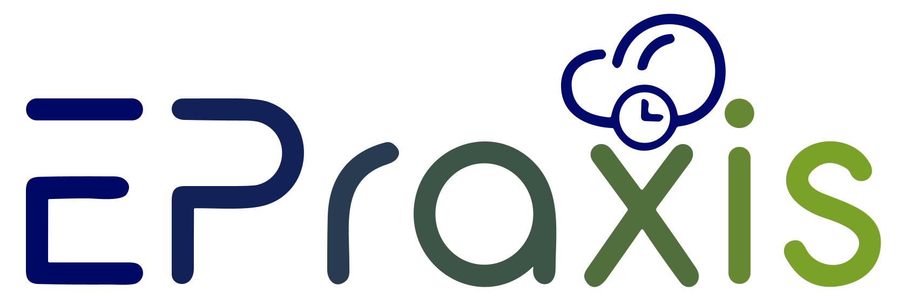

<p align="center"></p>

## Über ePraxis

Dieses Projekt konzentriert sich auf die Entwicklung einer Web-Anwendung namens ePraxis, die darauf abzielt, sowohl Patienten bei der Terminbuchung als auch Ärzte und medizinisches Personal bei ihren täglichen Aktivitäten zu unterstützen.

## Einrichten der Entwicklungsumgebung

Stellen Sie bitte sicher, dass [PHP](https://www.php.net/), [Composer](https://getcomposer.org/), [XAMPP](https://www.apachefriends.org) und [Nodejs](https://nodejs.org/en/) auf Ihrem Computer installiert sind.

## Installationsschritte

1. Navigieren Sie zum Projektordner:

Um die Anwendung lokal ausführen zu können, stellen Sie bitte sicher, dass der Projektordner in der XAMPP-Datei auf 'htdocs' gesetzt ist.

z.B.
```console
cd htdocs/epraxis/
```
2. Composer-Abhängigkeiten installieren:
```console
composer install
```
3. NPM-Abhängigkeiten installieren:
```console
npm install
```
4. Kopieren Sie die Datei **.env.example** und erstellen Sie ein Duplikat. Verwenden Sie den Befehl **cp** für Linux- oder Mac-Benutzer.
```console
cp .env.example .env
```
Wenn Sie Windows verwenden, verwenden Sie **copy** anstelle von **cp**.
```console
copy .env.example .env
```
5. Generieren Sie den Chiffrierschlüssel für die Anwendung:
```console
php artisan key:generate
```
6. Datenbankmigrationen ausführen:
```console
php artisan migrate
```

7. Datenbank-Seeder ausführen:
```console
php artisan db:seed
```  
8. Starten Sie den localhost-Server:
```console
php artisan serve
```  
Dann gehen Sie zu http://127.0.0.1:8000
